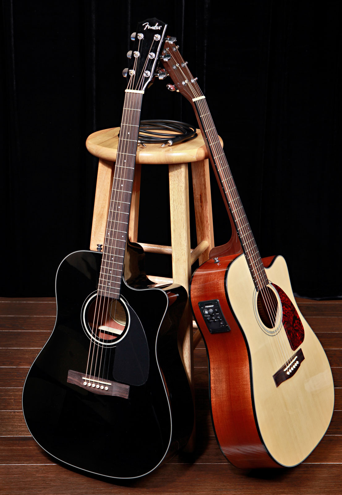

<head>
    ТОП САМЫХ ПОПУЛЯРНЫХ МУЗЫКАЛЬНЫХ ИНСТРУМЕНТОВ
     
  </head>
  <body>
   <h1>
       Гитара 
     </h1>
  

  Такая популярность данного инструмента легко объяснятся ее универсальностью, ведь гитары востребованы как при исполнении классических композиций, так и рока, блюза, джаза, поп, электронной музыки и других жанров. К тому же гитара относится к виду струнных, на которых легче всего научиться играть, причем как на любительском, так и профессиональном уровне. Разнообразие моделей гитар поражает, каждый ценитель музыки найдет свое идеальное звучание, выбрав акустику, бас или электрогитару с удобным количеством струн.
   

    
    
  <h2>Барабаны
    </h2>
  <p2>Без ударной установки не обходится ни один концерт или репетиция музыкального ансамбля. Барабаны задают ритм, делают музыку живой и настоящей, придают ей более резкое и насыщенное звучание. Они используются как в составе ритм-групп, так и могут выступать в роли солирующего инструмента. Также они являются еще одним излюбленным инструментом начинающего музыканта.
   </p2>
  <h3>Cкрипка
   </h3>
  <p3>Скрипка — не только ведущий сольный смычковый инструмент, но и незаменимая часть любого симфонического оркестра. Данный инструмент обрел всемирную популярность еще в 17 веке. И с тех пор никогда не сдает своих высоких позиций в списке самых востребованных музыкальных инструментов.</p3>
  <h4>Саксофон
   </h4>
  <p4>Еще один популярный музыкальный инструмент наравне со скрипкой и флейтой. Проигрыши саксофона можно услышать во многих треках, а на концертах — сольные выступления. К тому же в студиях звукозаписи, не смотря на популярность цифровых сэмплов, живую тональность саксофона может передать только реальный инструмент.
   </p4>
  <h5>Пианино
     <h5>
    <p5>Сложно представить мир музыки без мелодичных и льющихся тонов фортепиано. С момента изобретения пианино в 19 веке, без этого клавишного инструмента не обходится ни один концерт или выступление. Фортепиано используется как сольно, так и в составе ансамбля. И уже много лет является излюбленным инструментом начинающих музыкантов, ведь научится играть на таком клавишном проще всего.
        </p5>
  <h6>Рояль
     </h6>
     <p6>Очень часто рояль называют королевским клавишным инструментом. Кроме богатого и презентабельного облика, рояль выдает громкий, звучный, мелодичный, насыщенный и выразительный звук. Научившись играть на более простом пианино, музыкант сможет выйти на более высокий профессиональный уровень, сев за рояль. Рояль дает возможность мастеру достичь поистине виртуозной игры, используя свои широкие диапазонные и тональные возможности.
         </p6>
 
    
